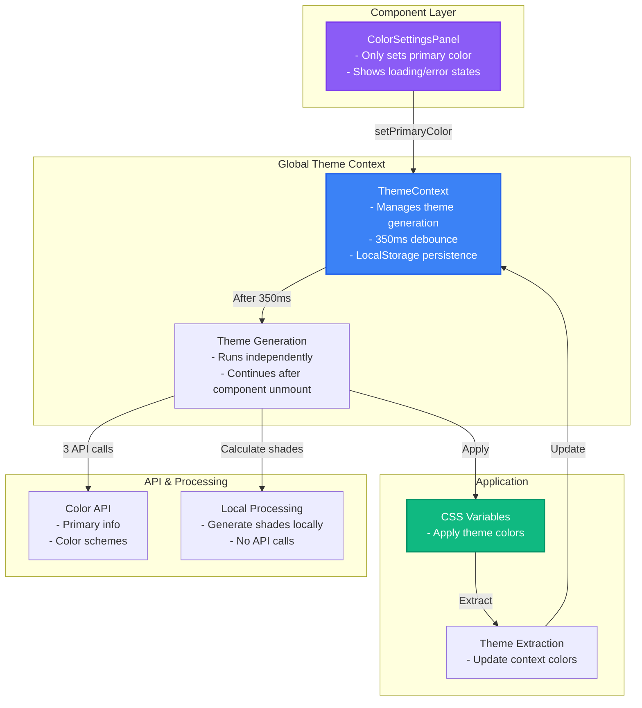

## Dimitri's Portfolio

This repository contains the source code for my personal portfolio, designed to showcase my skills in full-stack engineering, data science, and application architecture. The site is not just a static page, but a fully interactive application with several advanced features under the hood.

### Core Technologies

- **Framework**: Next.js 15 (React 18)
- **Language**: TypeScript
- **Styling**: Tailwind CSS, framer motion
- **3D Graphics**: Three.js / react-three-fiber
- **Deployment**: Vercel

---

### Key Engineering Achievements

#### 1. Adaptive Performance System

The application dynamically adjusts its performance based on the user's hardware.

- **Hardware-Aware Context**: A custom React context (`HardwarePerformanceContext`) detects CPU cores, RAM, and GPU capabilities on page load.
- **Dynamic Feature Scaling**: Component-heavy features, like the 3D network background, scale their complexity (e.g., node count, animation detail) to ensure a smooth experience on any device, from a high-end desktop to a mobile phone.
- **Performance-Optimized Animations**: Animations and 3D rendering loops leverage `requestIdleCallback` and pre-computed trigonometry tables to minimize their impact on the main thread.

#### 2. Advanced Theming Engine

The entire visual theme of the site is generated on the fly and is fully customizable by the user.

- **API-Driven Color Palettes**: The `ThemeContext` integrates with The Color API to generate harmonious and accessible color palettes (primary, secondary, accent) from a single user-selected primary color.
- **Local Generation & Caching**: To minimize API calls, shades and tints are generated locally. The generated theme is persisted to `localStorage`, allowing user customizations to carry across sessions.
- **Robust Error Handling**: The theme generation process is wrapped in a custom `retryWithBackoff` utility to handle transient network failures gracefully.

The diagram below illustrates the data flow for theme generation:



#### 3. High-Fidelity 3D Visualizations

The portfolio features multiple interactive 3D components built from the ground up.

- **Interactive Network Background**: A dynamic 3D particle system with real-time physics. Nodes react to mouse movements and intelligently avoid colliding with on-page HTML content.
- **WebGL Performance**: The system is highly optimized, using object pooling to manage `three.js` geometries and materials, significantly reducing GC pressure and preventing frame drops.
- **3D Word Cloud**: An interactive sphere of skills that can be rotated and explored by the user, with custom GLSL shaders for effects like front/back opacity.

#### 4. Resilient & Scalable Architecture

The codebase is designed with best practices to ensure it is robust, maintainable, and scalable.

- **Specialized Contexts**: The application state is managed through a series of specialized React contexts, avoiding monolithic state stores and promoting a clean separation of concerns.
- **Backend API**: The contact form is powered by a Next.js API route that includes Zod for validation and securely sends emails via AWS SES.
- **Reusable Hooks**: Custom hooks like `useDebouncedValue` and `useContactFormMutation` encapsulate complex logic and are used throughout the application.

---

### How to Run Locally

1.  **Clone the repository:**

    ```bash
    git clone https://github.com/your-username/your-repo-name.git
    cd your-repo-name
    ```

2.  **Install dependencies:**

    ```bash
    npm install
    ```

3.  **Set up environment variables:**
    Create a `.env.local` file by copying `.env.example`. You will need to add your AWS SES credentials to enable the contact form.

4.  **Run the development server:**
    ```bash
    npm run dev
    ```

Open [http://localhost:3000](http://localhost:3000) to view the site.
